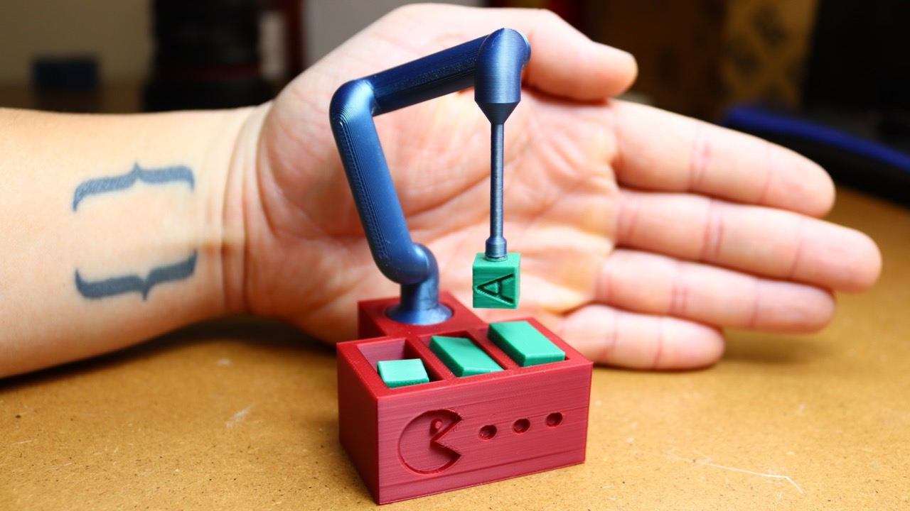

# Miniature Articulated Pick and Place Robot

This project was a goodbye gift for [@diogoalmeida](https://github.com/diogoalmeida) as he left Ocado.

It's basically a mini version of our work setup that you can play with by hand.

Full story and build can be watched [here](https://youtu.be/-3FgvnitcXA).
It's not a tutorial but I still suggest watching it if you're planning on printing it yourself.

## 3D Printing

All the models for the 3D prints are in the [models](./models/) folder.

### Printing SKUs

The SKUs (tea boxes) have a hollow interior to fit the magnets. You have to set your 3D printer to pause mid print so you can add those magnets manually.

## Extra Parts

To be able to move the joints I simply added some magnets to the build.

I'll add some affiliated links for the ones that I got here:
- Joint Magnets: https://amzn.to/4hY1s1b (Amazon)
- Suction Cup Magnets: https://amzn.to/3QjkovF (Amazon)